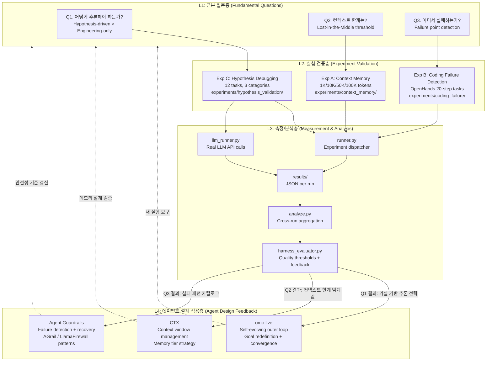

# LiveCode -- Fully Autonomous Agent Research Platform

## 핵심 개념

완전 자율 에이전트(Fully Autonomous Agent)가 신뢰할 수 있게 작동하려면 3가지 근본 질문에 대한 실증적 답이 필요하다. LiveCode는 이 질문들을 통제된 실험으로 측정하고, 결과를 실제 자율 에이전트 시스템 설계에 피드백하는 연구 플랫폼이다.

| 근본 질문 | 실험 | 핵심 발견 |
|-----------|------|-----------|
| Q1. 에이전트는 **어떻게 추론**해야 하는가? | Exp C (Hypothesis Debugging) | 가설 기반 사고가 causal/assumption 버그에서 시행착오를 1회로 줄임 |
| Q2. 에이전트의 **컨텍스트 한계**는 어디인가? | Exp A (Context Memory) | 1K~100K 토큰 범위에서 Lost-in-the-Middle 현상 정량 측정 |
| Q3. 에이전트는 **어디서 실패**하는가? | Exp B (Coding Failure) | OpenHands 20-step 자율 실행의 실패 지점 탐지 및 분류 |

## 개념도



## 3개 근본 질문

### Q1. 에이전트는 어떻게 추론해야 하는가? -- Exp C

자율 에이전트가 버그를 만나면 패턴 매칭으로 시행착오를 반복하는가(Engineering-only), 원인 가설을 세우고 검증하는가(Hypothesis-driven)? 12개 버그 시나리오(Simple/Causal/Assumption)에서 두 전략을 실측했다.

**핵심 결과 (2026-03-30)**:
- Simple 버그: 두 전략 모두 1회 시도로 해결 (차이 없음)
- Causal 버그: Engineering 1.75회 vs Hypothesis 1.0회 (0.75회 절감)
- Assumption 버그: Engineering 2.0회 vs Hypothesis 1.0회 (1.0회 절감)
- 가설 정확도 (첫 가설 적중률): **100%**

**에이전트 설계 시사점**: 난이도가 높아질수록 가설 기반 추론의 효율 이득이 커진다. 자율 에이전트의 디버깅 모듈은 "증상 관찰 -> 원인 가설 -> 검증" 루프를 기본 전략으로 채택해야 한다.

**관련 연구**: Verification-First 전략 (HumanEval +5.4%p), Reflexion 에피소드 피드백, LATS Monte Carlo Tree Search

### Q2. 에이전트의 컨텍스트 한계는? -- Exp A

자율 에이전트가 긴 컨텍스트에서 정보를 얼마나 정확하게 기억하는가? Lost-in-the-Middle 현상이 실제 에이전트 성능에 어떤 영향을 미치는가?

**실험 설계**: 1K, 10K, 50K, 100K 토큰 길이에서 36개 데이터포인트 측정. 컨텍스트 내 위치(앞/중간/뒤)별 정보 유지율 추적.

**에이전트 설계 시사점**: 컨텍스트 한계를 초과하면 에이전트는 침묵 실패(silent failure)한다. omc-live의 outer loop에서 context exhaustion 감지와 메모리 계층화(flat JSONL -> structured memory tiers) 전략이 필수적이다.

**관련 연구**: Goal Drift (>100K 토큰에서 goal adherence 저하), A-MEM Zettelkasten 동적 메모리, MIRIX 6종 전문화 메모리

### Q3. 에이전트는 어디서 실패하는가? -- Exp B

자율 에이전트(OpenHands)에 20-step 코딩 태스크를 맡겼을 때, 어디서 어떻게 실패하는가?

**실험 설계**: OpenHands 에이전트가 20단계 이내로 태스크를 자율 수행. 각 단계의 행동/결과를 기록하여 실패 지점과 실패 유형을 분류.

**에이전트 설계 시사점**: 자율 에이전트의 실패는 대부분 "잘못된 task 분해", "역할 불복종", "과도한 경계 침범"에서 발생한다. 실패 패턴 카탈로그를 기반으로 guardrail(AGrail, LlamaFirewall 패턴)을 설계할 수 있다.

**관련 연구**: HITL/HOTL 프레임워크, OpenHands SWE-bench 60.6%, Agent0 co-evolution

## 연구 -> 적용 흐름

LiveCode의 실험 결과는 다음과 같이 실제 자율 에이전트 시스템에 반영된다:

```
LiveCode 실험                     자율 에이전트 시스템
-----------------                 ---------------------
Exp C 결과                   -->  omc-live: 가설 기반 추론을 outer loop의
(가설 기반 추론 우위 실증)          기본 디버깅 전략으로 채택.
                                  "약한 차원 타겟팅"으로 goal 상향.

Exp A 결과                   -->  CTX: 컨텍스트 한계 임계값 기반으로
(컨텍스트 페이드 정량화)            메모리 계층 전환 시점 결정.
                                  context exhaustion 감지 -> 새 컨텍스트 재시작.

Exp B 결과                   -->  Agent Guardrails: 실패 패턴 카탈로그로
(실패 지점 분류)                   사전 방어 로직 구성.
                                  task 분해 검증, 경계 침범 감지.
```

### omc-live 자가 진화 외부 루프

LiveCode 연구의 최종 적용 대상. 실험 결과를 종합하여:

1. **추론 전략** (Q1 -> Exp C): Hypothesis-driven reasoning을 기본 문제 해결 전략으로 내장
2. **수렴 판단** (Q2 -> Exp A): 다차원 점수 + delta 임계값으로 수렴 감지, 단일 YES/NO 판정 지양
3. **안전 가드레일** (Q3 -> Exp B): 실패 패턴 기반 사전 방어, catastrophic forgetting 완화

핵심 메커니즘: YES -> score(4차원) -> |delta| < epsilon for plateau_k -> CONVERGED. 수렴 후에도 최저 점수 차원을 타겟으로 goal을 상향 재정의하여 루프를 이어간다.

## Component Map

| Component | Location | Role |
|-----------|----------|------|
| `runner.py` | root | 실험 디스패처 -- `--exp a/b/c` |
| `llm_runner.py` | `experiments/hypothesis_validation/` | 실제 LLM API 호출 (Exp C) |
| `experiments/context_memory/` | `experiments/` | Exp A: 1K~100K 토큰 컨텍스트 페이드 측정 |
| `experiments/coding_failure/` | `experiments/` | Exp B: OpenHands 20-step 실패 탐지 |
| `experiments/hypothesis_validation/` | `experiments/` | Exp C: 가설 vs Engineering 디버깅 비교 |
| `analyze.py` | root | 교차 실행 집계, 트렌드 감지, 전체 파이프라인 (`--run`) |
| `harness_evaluator.py` | root | Harness 품질 자체 평가 -- 임계값, 교차 실행 diff, 피드백 |
| `app.py` | root | Streamlit 대시보드 |
| `api.py` | root | REST API layer |
| `results/` | root | 실행별 JSON 결과 파일 |
| `constants.py` | root | `RESULTS_DIR`, `ExperimentName`, 품질 임계값 |
| `cache.py` | root | LLM 응답 캐싱 |

## 관련 연구 문서

| Document | Key Topic |
|----------|-----------|
| `docs/research/20260323-hypothesis-driven-agent-research.md` | 가설 기반 사고의 에이전트 성능 영향 (SOTA survey) |
| `docs/research/20260324-autonomous-agent-vs-interactive-ai-division.md` | 자율 에이전트 vs HITL 분업 경계 |
| `docs/research/20260326-omc-live-self-evolving-outer-loop.md` | omc-live 자가 진화 수렴 기준 설계 |
| `docs/research/20260328-omc-live-infinite-loop-architecture-research.md` | 무한 자율 에이전트 순환구조 SOTA |
| `docs/research/20260330-hypothesis-experiment-results.md` | Exp C 실험 결과 상세 (v5, 12 tasks) |
| `docs/research/20260330-harness-engineering.md` | Harness 자체 평가 엔지니어링 |
